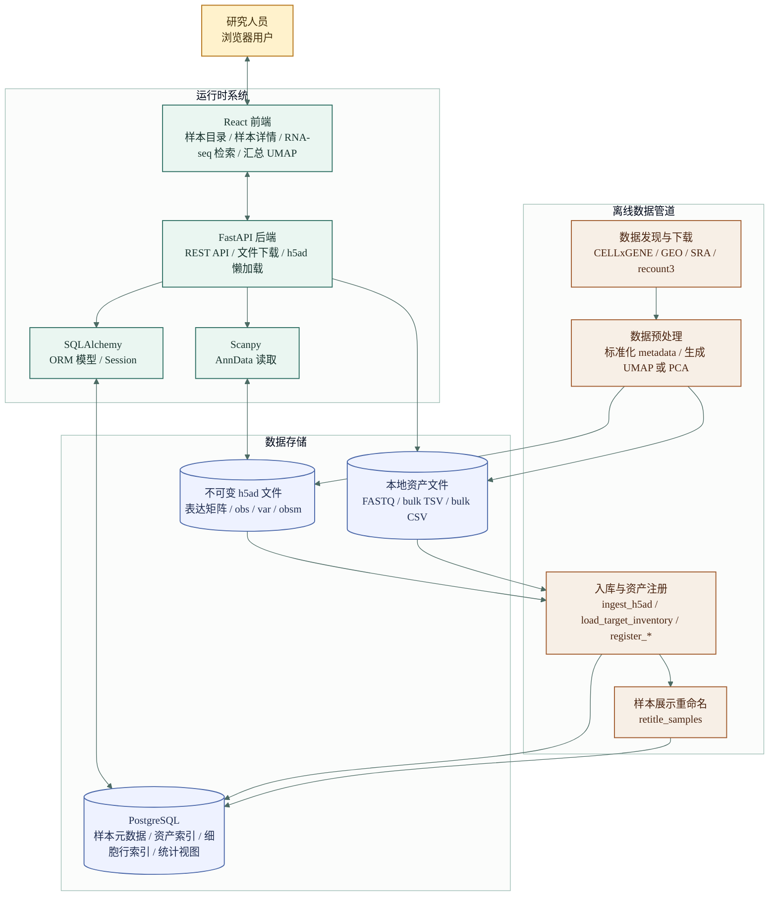
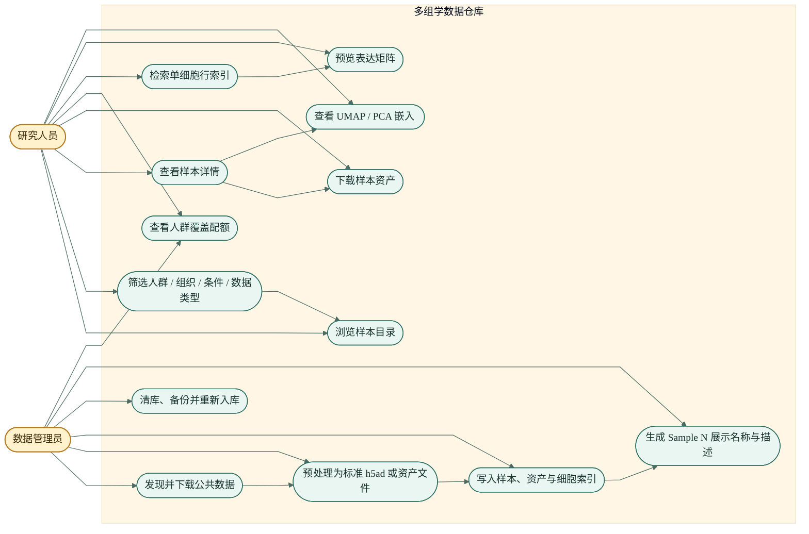
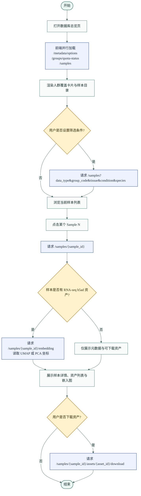
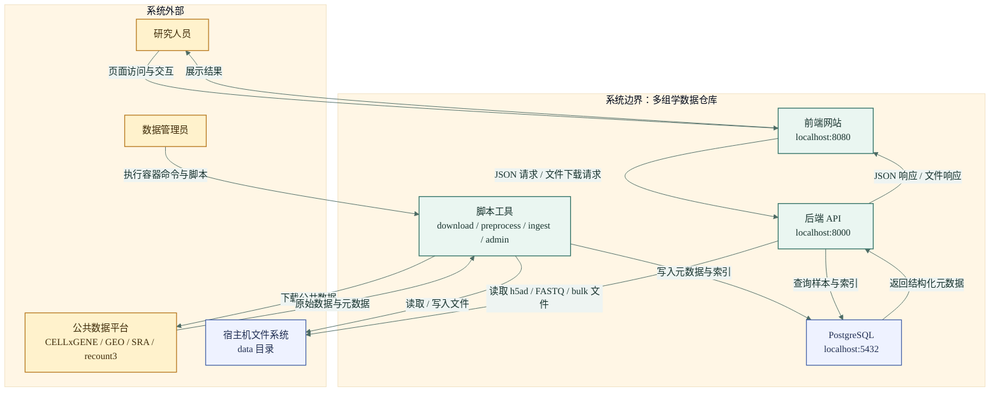
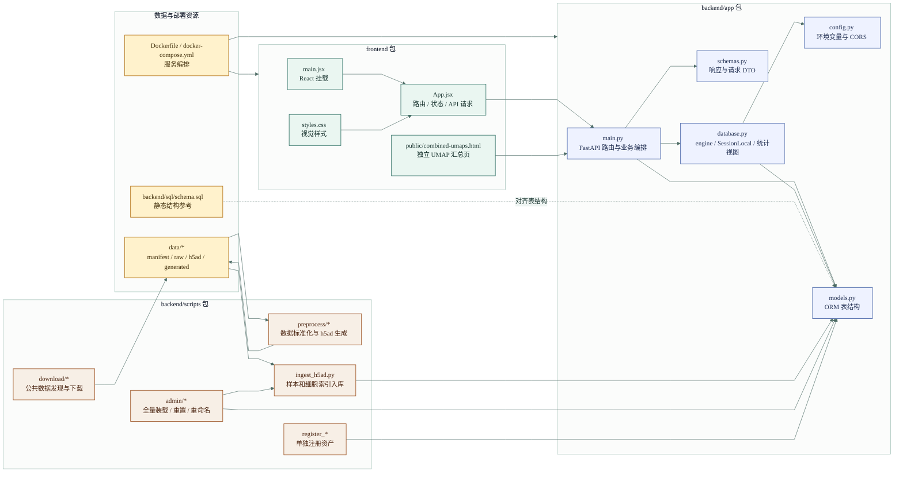
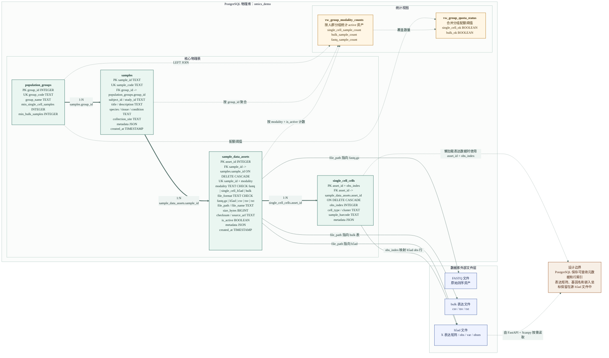
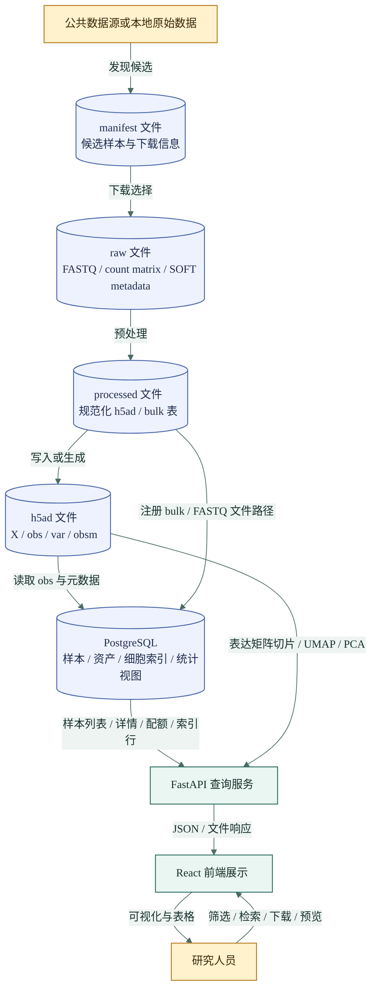
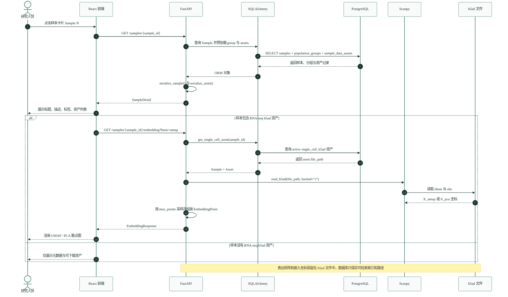
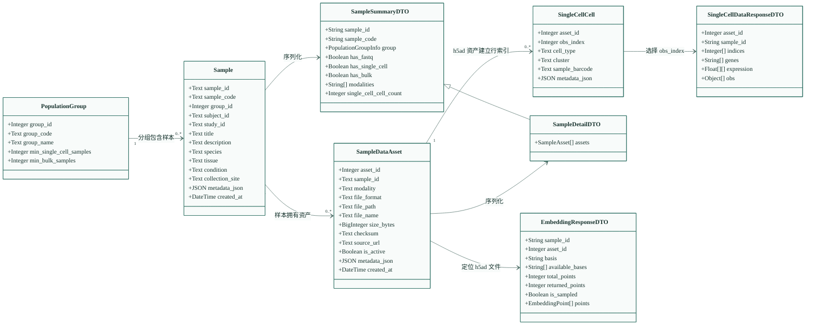

# 系统级软件工程图（Mermaid 对照版）

本文件是第二版 Mermaid 图集，用于和 `docs/system-engineering-figures-mermaid.md` 对照。图的内容仍严格对应当前项目实现，但在布局、分层和节点组织上重新绘制。

## 1. 系统结构图

## 2. 系统整体用例图

## 3. 功能流程图

该图聚焦“样本目录浏览到详情、下载与嵌入图查看”的用户功能路径。

## 4. 系统与外部实体交互图

## 5. 架构设计包图

## 6. 数据库物理模型图

该图描述当前 PostgreSQL 物理表、主外键、唯一约束、检查约束、统计视图，以及数据库索引记录与外部文件资产之间的对应关系。表达矩阵本体不进入数据库，数据库只保存样本元数据、资产路径和单细胞行级索引。

## 7. 数据流图

## 8. 业务流程图

```mermaid
%%{init: {"theme":"base","themeVariables":{"fontFamily":"PingFang SC, Microsoft YaHei, sans-serif","primaryColor":"#F8FBFA","primaryTextColor":"#17322D","primaryBorderColor":"#2E6F63","lineColor":"#4C6B64","secondaryColor":"#EEF4F2","tertiaryColor":"#FFF6E5","clusterBkg":"#FBFCFB","clusterBorder":"#9DBDB4"},"flowchart":{"curve":"stepAfter","htmlLabels":true}} }%%
flowchart LR
    subgraph A["阶段一：数据准备"]
        A1["发现或选择数据源"]
        A2["生成 manifest"]
        A3["审核 selected 样本"]
        A4["下载原始数据"]
    end

    subgraph B["阶段二：标准化处理"]
        B1["单细胞数据标准化 obs / metadata"]
        B2["bulk 数据转换为可入库格式"]
        B3["计算或保留 UMAP / PCA"]
        B4["输出 processed h5ad 或资产文件"]
    end

    subgraph C["阶段三：仓库入库"]
        C1["初始化数据库结构与人群分组"]
        C2["写入 samples"]
        C3["写入 sample_data_assets"]
        C4["写入 single_cell_cells 行索引"]
        C5["刷新人群覆盖统计视图"]
        C6["生成 Sample N 展示标题和环境描述"]
    end

    subgraph D["阶段四：用户使用"]
        D1["浏览样本目录"]
        D2["按人群与数据类型筛选"]
        D3["查看详情和下载资产"]
        D4["检索单细胞行"]
        D5["预览表达矩阵或查看嵌入图"]
    end

    A1 --> A2 --> A3 --> A4 --> B1
    A4 --> B2
    B1 --> B3 --> B4
    B2 --> B4
    B4 --> C1 --> C2 --> C3 --> C4 --> C5 --> C6 --> D1
    D1 --> D2 --> D3
    D2 --> D4 --> D5
    D3 --> D5

    classDef prep fill:#FFF2CC,stroke:#B7791F,color:#3F2C09,stroke-width:1.3px;
    classDef norm fill:#F7EFE6,stroke:#A05A2C,color:#4A2410,stroke-width:1.3px;
    classDef ingest fill:#EEF2FF,stroke:#4966A8,color:#1F2D50,stroke-width:1.3px;
    classDef use fill:#EAF6F1,stroke:#2E6F63,color:#17322D,stroke-width:1.3px;
    class A1,A2,A3,A4 prep;
    class B1,B2,B3,B4 norm;
    class C1,C2,C3,C4,C5,C6 ingest;
    class D1,D2,D3,D4,D5 use;
```

## 9. 复杂功能时序图

该图描述“打开样本详情并加载嵌入图”的时序，对应 `/samples/{sample_id}` 与 `/samples/{sample_id}/embedding`。

## 10. 类图

