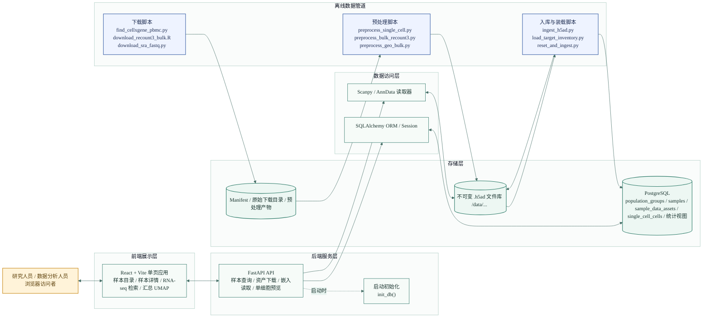
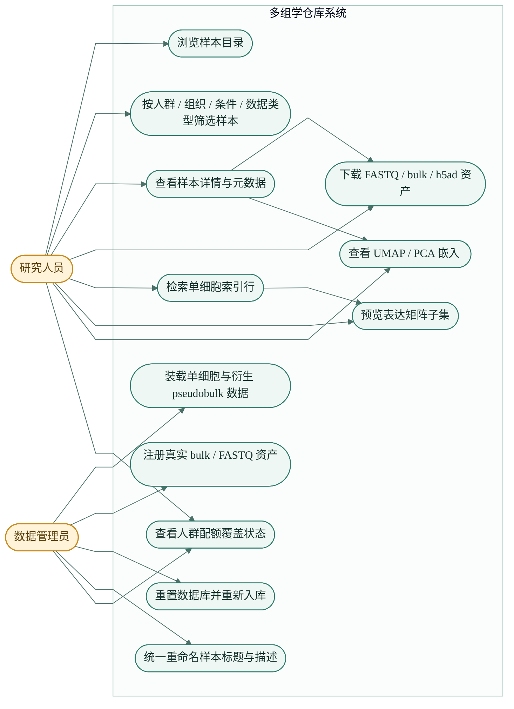
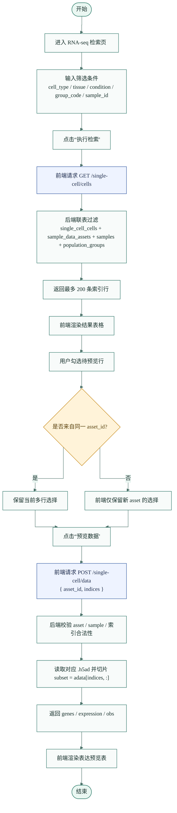
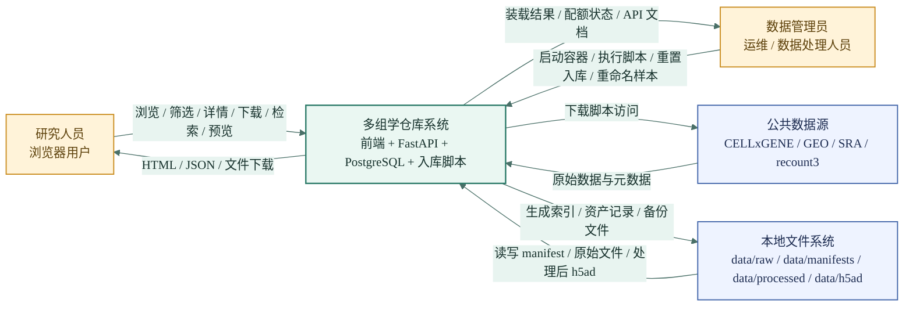
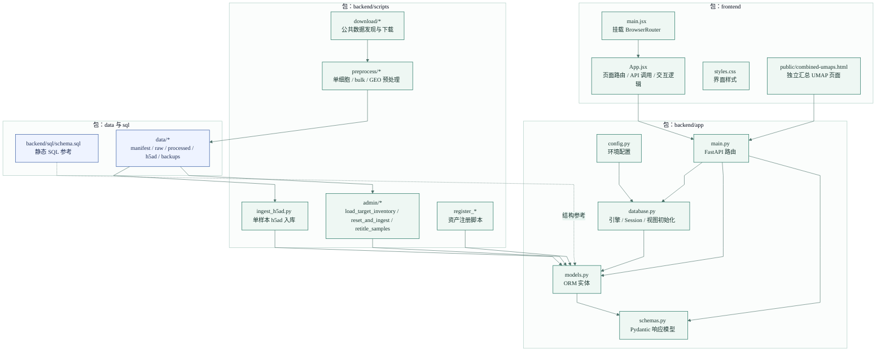
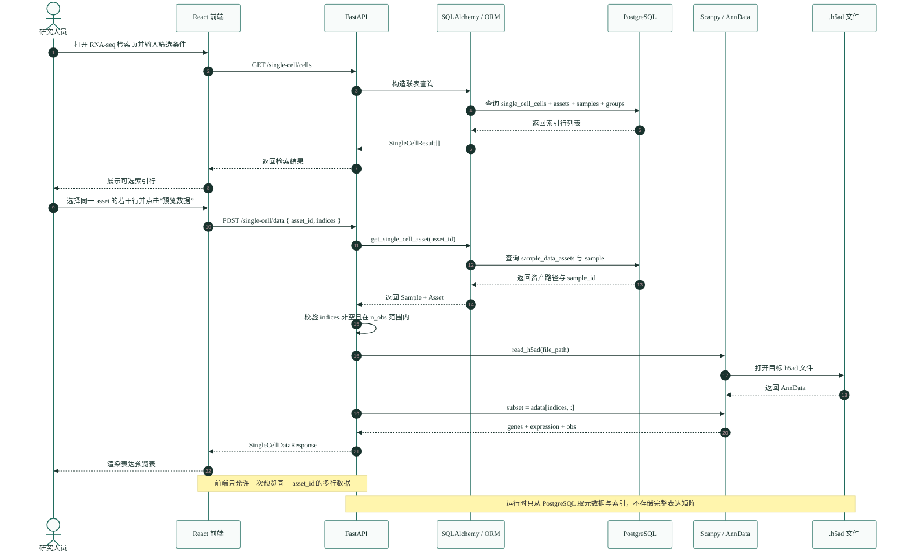
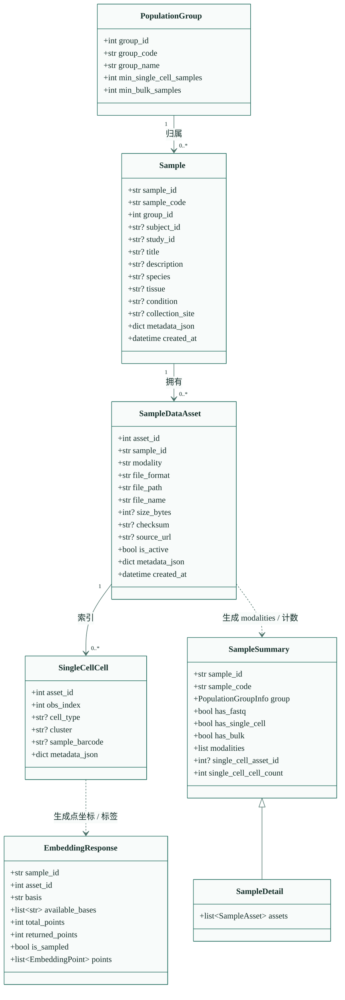

# 系统级软件工程图（Mermaid）

以下图形基于当前仓库实现整理，覆盖前端、后端、数据库、`.h5ad` 数据文件、入库脚本与真实数据处理脚本。

对应代码入口：

- 前端入口：`frontend/src/main.jsx`、`frontend/src/App.jsx`
- API 与运行时服务：`backend/app/main.py`
- ORM 与数据库初始化：`backend/app/models.py`、`backend/app/database.py`
- 单细胞入库：`backend/scripts/ingest_h5ad.py`
- 全量装载与重命名：`backend/scripts/admin/load_target_inventory.py`
- 重置并重入库：`backend/scripts/admin/reset_and_ingest.py`

## 1. 系统结构图

## 2. 系统整体用例图

## 3. 功能流程图

说明：该图描述用户侧“单细胞检索与表达预览”功能流程，对应 `frontend/src/App.jsx` 中的 `SingleCellQuery` 与后端 `/single-cell/cells`、`/single-cell/data` 接口。

## 4. 系统与外部实体交互图

## 5. 架构设计包图

## 6. 数据流图

```mermaid
%%{init: {'theme':'base','themeVariables': {'fontFamily':'PingFang SC, Microsoft YaHei, sans-serif','primaryColor':'#F8FBFA','primaryTextColor':'#18322D','primaryBorderColor':'#1F6B5D','lineColor':'#4A7068','secondaryColor':'#E8F4F0','tertiaryColor':'#FFF8E8'}, 'flowchart': {'curve':'basis','htmlLabels': true}} }%%
flowchart LR
    E1["外部实体 E1<br/>研究人员"]
    E2["外部实体 E2<br/>数据管理员"]
    E3["外部实体 E3<br/>公共数据源"]

    P1["处理 P1<br/>下载与预处理"]
    P2["处理 P2<br/>h5ad 入库与资产注册"]
    P3["处理 P3<br/>API 查询服务"]
    P4["处理 P4<br/>h5ad 细胞矩阵 / 嵌入读取"]

    D1[("数据存储 D1<br/>Manifest / Raw / Processed 文件")]
    D2[("数据存储 D2<br/>PostgreSQL 元数据与索引")]
    D3[("数据存储 D3<br/>不可变 .h5ad 文件")]

    E3 -- 原始样本数据 / 元信息 --> P1
    E2 -- 触发脚本 / 选择 manifest --> P1
    P1 -- 预处理结果 --> D1
    D1 -- 处理后 h5ad / CSV / FASTQ 路径 --> P2
    P2 -- 样本、资产、细胞索引 --> D2
    P2 -- 标准化 h5ad --> D3

    E1 -- 浏览 / 筛选 / 检索请求 --> P3
    P3 -- 样本目录 / 详情 / 配额 / 索引行 --> E1
    P3 -- 结构化查询 --> D2
    D2 -- 元数据 / asset_id / obs_index --> P3

    P3 -- 细胞预览 / 嵌入读取请求 --> P4
    P4 -- 文件路径 / sample_id / asset_id --> D2
    D2 -- 资产路径 / 过滤上下文 --> P4
    P4 -- 读取矩阵 / embedding --> D3
    D3 -- 基因 / 表达矩阵 / 坐标 --> P4
    P4 -- 预览数据 / 嵌入点 --> P3

    classDef ext fill:#FFF3D9,stroke:#C98B1D,color:#5E420C,stroke-width:1.4px;
    classDef proc fill:#EAF7F2,stroke:#2B7A68,color:#17322D,stroke-width:1.4px;
    classDef store fill:#EEF3FF,stroke:#3F63A8,color:#1E2D52,stroke-width:1.4px;
    class E1,E2,E3 ext;
    class P1,P2,P3,P4 proc;
    class D1,D2,D3 store;
```

## 7. 业务流程图

说明：该图描述真实数据从发现、预处理、入库到可查询的业务闭环。

```mermaid
%%{init: {'theme':'base','themeVariables': {'fontFamily':'PingFang SC, Microsoft YaHei, sans-serif','primaryColor':'#FAFCFB','primaryTextColor':'#18322D','primaryBorderColor':'#1F6B5D','lineColor':'#4A7068','secondaryColor':'#E8F4F0','tertiaryColor':'#FFF8E8','clusterBkg':'#FBFDFC','clusterBorder':'#A7C9BF'}, 'flowchart': {'curve':'stepAfter','htmlLabels': true}} }%%
flowchart LR
    subgraph L1["泳道：数据管理员"]
        B1["选择来源与候选项目"]
        B2["审核 manifest 中选中样本"]
        B3["执行重置或装载命令"]
        B4["在前端验证结果"]
    end

    subgraph L2["泳道：下载 / 预处理脚本"]
        C1["发现候选数据<br/>CELLxGENE / recount3 / GEO / SRA"]
        C2["下载原始文件"]
        C3["预处理为规范化 h5ad / CSV / FASTQ"]
    end

    subgraph L3["泳道：入库脚本"]
        D1["读取处理后 h5ad / manifest"]
        D2["写入样本主数据"]
        D3["注册 bulk / FASTQ / h5ad 资产"]
        D4["构建 single_cell_cells 行级索引"]
        D5["生成人群覆盖统计视图"]
        D6["统一重命名样本标题与描述"]
    end

    subgraph L4["泳道：运行时系统"]
        E1["FastAPI 提供查询与下载接口"]
        E2["前端展示目录、详情、嵌入与表达预览"]
    end

    B1 --> C1 --> B2 --> C2 --> C3 --> B3 --> D1 --> D2 --> D3 --> D4 --> D5 --> D6 --> E1 --> E2 --> B4

    classDef lane fill:#EAF7F2,stroke:#2B7A68,color:#17322D,stroke-width:1.2px;
    classDef ops fill:#FFF3D9,stroke:#C98B1D,color:#5E420C,stroke-width:1.2px;
    class B1,B2,B3,B4 ops;
    class C1,C2,C3,D1,D2,D3,D4,D5,D6,E1,E2 lane;
```

## 8. 复杂功能时序图

说明：该图描述“单细胞表达预览”这一复杂功能的调用时序。

## 9. 类图

